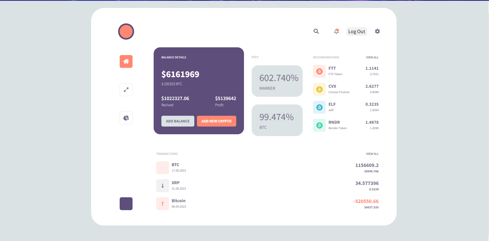

# Crypto Portfolio Tracker Web App - Readme



Welcome to the Crypto Portfolio Tracker web app! This application allows users to manage and track their cryptocurrency investments with a user-friendly interface. Similar to a stock portfolio tracker, this app is tailored for the world of cryptocurrencies, helping users monitor their holdings, track profits and losses, and stay updated on market trends. Below is a guide to help you understand and set up the app.

## Table of Contents

- [Features](#features)
- [Getting Started](#getting-started)
  - [Prerequisites](#prerequisites)
  - [Installation and Setup](#installation-and-setup)
- [Usage](#usage)
  - [Creating an Account and Logging In](#creating-an-account-and-logging-in)
  - [Adding Crypto Holdings](#adding-crypto-holdings)
  - [Viewing and Managing Portfolio](#viewing-and-managing-portfolio)
- [Contributing](#contributing)
- [License](#license)

## Features

- **User Authentication**: Secure user registration and login system.
- **Portfolio Overview**: View all your cryptocurrency holdings at a glance.
- **Add Transactions**: Easily add buy and sell transactions to your portfolio.
- **Profit/Loss Tracking**: Real-time tracking of your investment profits and losses.
- **Price Updates**: Get up-to-date market prices for various cryptocurrencies.
- **Responsive Design**: The app works smoothly on both desktop and mobile devices.

## Getting Started

### Prerequisites

- **ASP.NET Core**: Make sure you have ASP.NET Core installed. You can download it from [dotnet.microsoft.com](https://dotnet.microsoft.com/download).
- **Node.js**: Make sure you have Node.js installed. You can download it from [nodejs.org](https://nodejs.org/).

### Installation and Setup

1. Clone this repository to your local machine or server:

   ```bash
   git clone https://github.com/your-username/crypto-portfolio-app.git

2. Navigate to the project directory:
   ```bash
   cd crypto-portfolio-app

3. Set up the ASP.NET Core API:
    - Open the CryptoPortfolioAPI folder in your preferred development environment (Visual Studio, Visual Studio Code, etc.).
    - Restore dependencies and build the project.
    - Configure your database connection in the appsettings.json file.
    - Run database migrations to create the necessary tables: dotnet ef database update.

4. Set up the JavaScript client:
    - Navigate to the ClientApp folder.
    - Install the required dependencies: npm install.

### Usage 
### Creating an Account and Logging In
1. Launch the ASP.NET Core API:
    ```bash
    dotnet run

2. Open your web browser and navigate to https://localhost:5001 (or the specified port).
3. Click on the "Sign Up" button to create a new account.
4. After registering, log in using your credentials.

### Adding Crypto Holdings
1. Once logged in, you'll be directed to your portfolio dashboard.
2. Click on the "Add Transaction" button for the cryptocurrency you want to add.
3. Fill in the transaction details, including the type (buy/sell), amount, and price.
4. Click "Save" to add the transaction to your portfolio.


### Viewing and Managing Portfolio
1. After adding transactions, your portfolio overview will display a list of your holdings.
2. The portfolio will show details like cryptocurrency name, current price, quantity held, total investment, and current value.
3. The portfolio page will also calculate your total profit/loss, considering current market prices.

### Contributing

Contributions are welcome! If you find any bugs or want to enhance the app, please open an issue or submit a pull request.

---

<p align="center">
  Made with ❤️ by [Your Name](https://github.com/TuralAsadli)
</p>